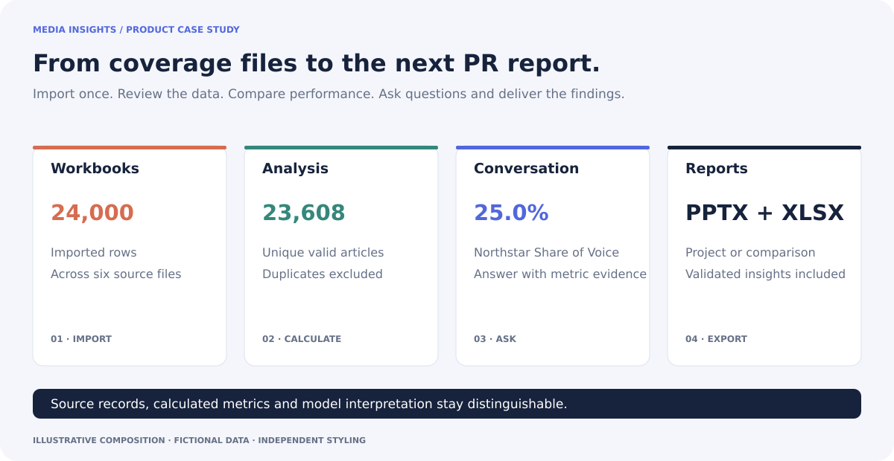
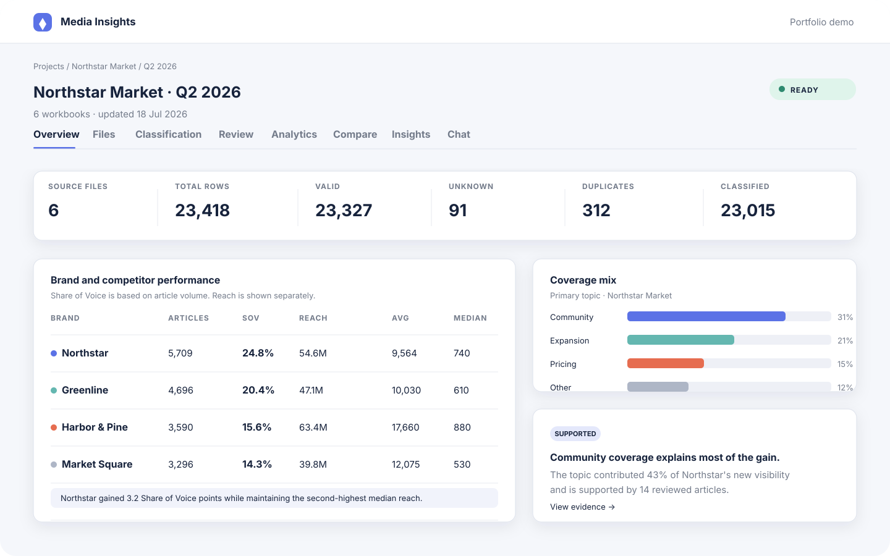
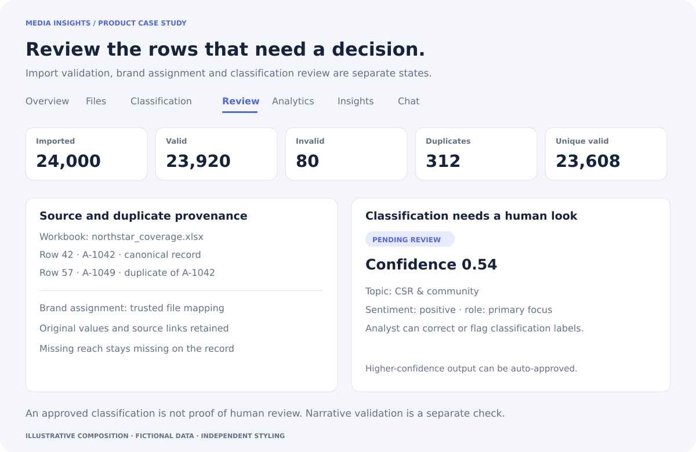
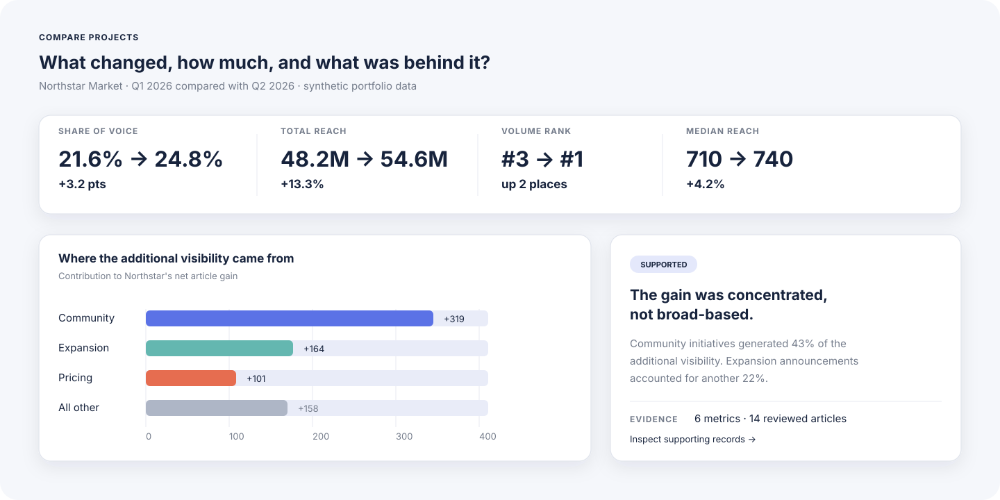
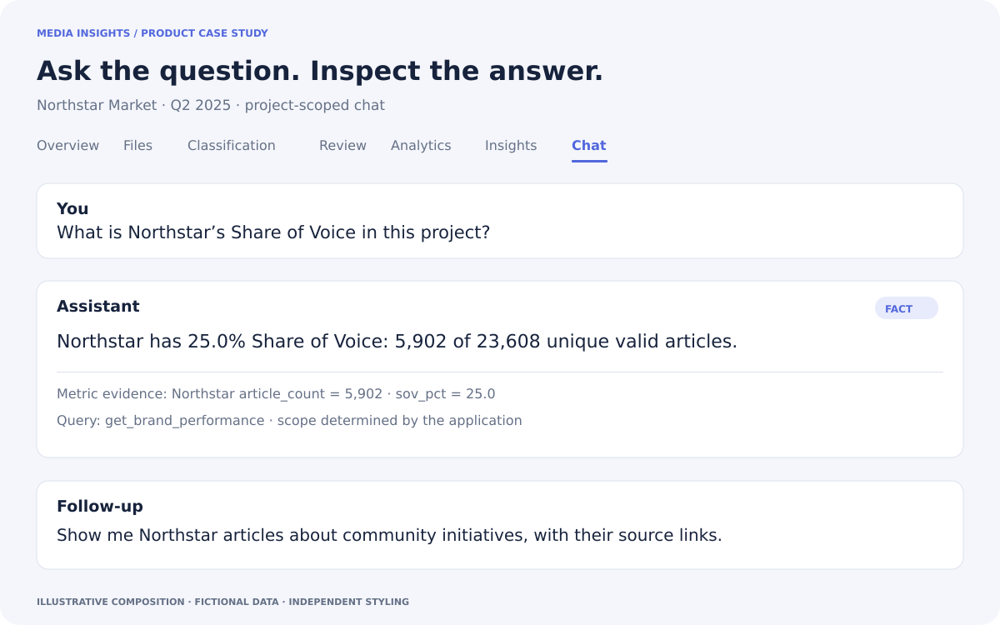
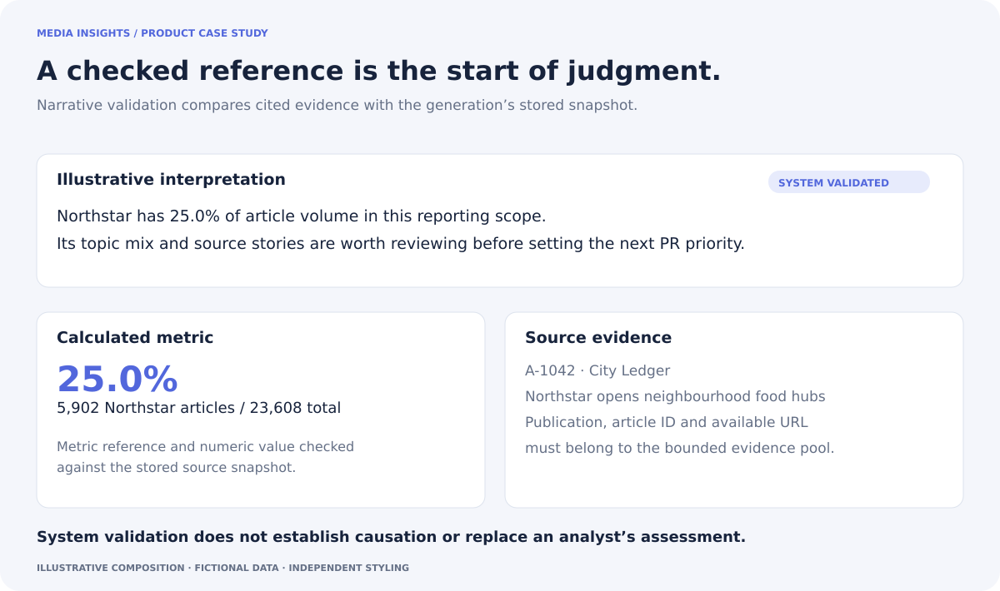
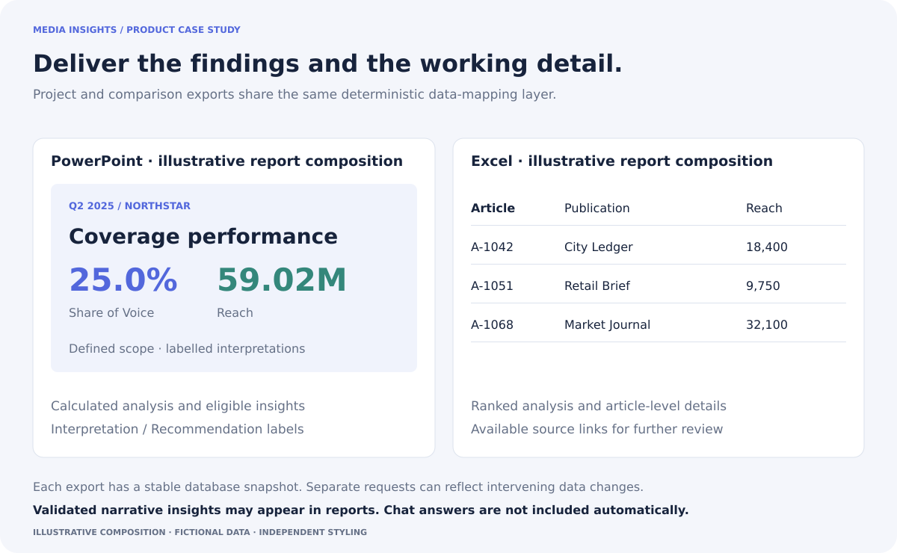

# Media Insights

### Thousands of articles. One place to make sense of them.

Media Insights helps PR teams turn media-monitoring spreadsheets into performance reports. Import the coverage, compare brands and periods, ask questions about the results, and export the analysis to PowerPoint or Excel.

 

## The spreadsheet is only the beginning

You have the quarter’s media coverage. Now you need to work out how the brand performed, what competitors did differently and what to recommend next. Before you get there, someone has to untangle the files, check repeated articles, fix inconsistent labels and make sure the numbers add up. Then comes the presentation.

I built Media Insights to keep that work together, from the first upload to the report a client or communications lead receives.

## Bring in the coverage and get to work

Upload multiple Excel workbooks into a reporting project. The app recognizes supported column names, checks the rows, flags duplicates and organizes articles by brand. It keeps the original values and available source links so you can go back and inspect a record.

From there, you can see which brands received coverage, how much reach they had, what topics appeared and whether a brand was the focus of an article or just mentioned in passing.

*All visuals use fictional data and independent styling. They illustrate the app’s workflows; they are not screenshots of the live product.*

## Spend time on the rows that need a second look

Repeated articles should not inflate the report. Missing reach should stay missing. A confident-looking label should still be open to correction.

The app identifies duplicate records and excludes them from the analysis. AI classifies topics, sentiment and the brand’s role in each article, while low-confidence results go into a review queue. You can correct labels and brand assignments without losing the original record.

Higher-confidence classifications can be approved automatically. That status does not mean a person has reviewed them.

## Find out what changed

More articles do not always mean better visibility. A competitor might publish less often but reach more people, while your brand appears frequently as a passing mention.

Compare brands within a period, one quarter against another, or the same quarter across years. You can also combine quarterly projects into half-year and full-year views, with repeated coverage excluded across projects.

The comparison brings together volume, Share of Voice, reach, sentiment and topic mix. It also shows which publications and stories moved up or down, helping you decide where to look before writing the conclusion.

## Ask the data a question

“Which brand gained Share of Voice?” is a useful starting point. “Show me its community coverage and the source articles” gets you closer to understanding why.

Chat works with the project or comparison you are looking at. It can retrieve metrics, topics, sentiment, publications, stories and articles, then include the supporting numbers and available links in its answer.

### Why build an app instead of just using Claude?

Because the work continues after the conversation. With tens of thousands of article records, I wanted the files, corrections, calculations and reporting periods to stay together, ready for the next question or the next report.

The database keeps the coverage. The app calculates the metrics. The model gets the relevant results through a fixed set of query tools. It does not have to remember the entire dataset, and the analyst does not have to keep moving it between spreadsheets, chats and slides.

## Turn the findings into a recommendation

Media Insights can draft summaries, findings, risks and recommendations from the analysis. Those drafts include references to supporting metrics and articles, which the app checks against the data used to generate them.

Checking a reference does not make a conclusion correct. The analyst still needs to decide whether the explanation holds up and what to recommend. The app keeps rejected drafts and their reasons, and it does not treat a system check as human sign-off.

## Get the report out

Both project and comparison reports export to **PowerPoint and Excel**. PowerPoint carries the analysis into a presentation; Excel provides the ranked results and article details for closer inspection or handoff.

Reports can include generated interpretations and recommendations that pass the app’s checks, with labels showing what they are. Chat replies are not added automatically. The aim is to carry the analysis into the final report without rebuilding it by hand.

## A few things worth knowing

This is a working app built for a defined retail reporting scope and supported `.xlsx` monitoring exports. It starts with coverage someone has already collected. It does not collect articles from the web or accept every spreadsheet format.

AI helps classify coverage, draft explanations and answer questions. The application handles validation, duplicate rules and calculations. For a closer look at those choices, see the [implementation notes](IMPLEMENTATION.md).

The stack is Python/FastAPI, PostgreSQL, Jinja2 and Tailwind CSS, with DeepSeek through n8n for language tasks. The operational repository includes tests for importing, analysis, comparisons, chat and exports. This public repository contains the case study and synthetic visuals.

## Why I built it

I work in product marketing, and building products is how I get past having opinions about features I have never had to make work.

This started with a practical question: could I spend less time moving media coverage between spreadsheets and presentations? Building it led to harder questions. What counts as the same article? What should happen when reach is missing? How much of a conclusion can you automate before you are just making a guess sound convincing?

That is why this project belongs in my portfolio. Getting close to the data, the interface and the implementation makes me better at deciding what a product should do and explaining why someone would use it.

**Understanding the system makes the product story better. Building the system makes the opinions harder to fake.**

---

All companies, publications, articles, filenames, dates and figures in these examples are fictional. Operational code, client data, employer branding and presentation templates are excluded.
